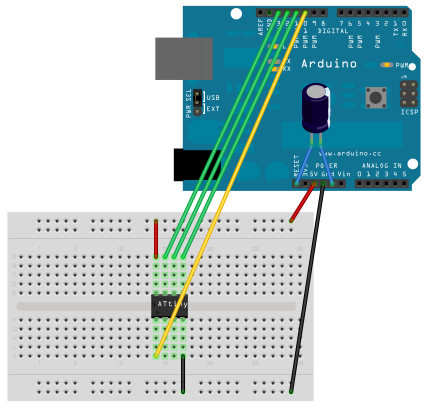

## Pioneers Brick

Pioneers Brick, is a small device built on a breadboard. It communicates with others of its kind using colours.

The brick is initialized with a random colour and adds new ones simply by being connected to fellow bricks.

The connecting bridge between two bricks is indicated by a blinking green light. If the contact has been successful, both devices will now include each other's initial colour.

### Attiny45 

the tiny has 4kb of flash memmory and 256 bytes of EEPROM memmory,
just enough to create the pioneers brick

#### Pinout

### Flashing the attiny

*  use Arduino 1.0.5 ( 2.0 is not tested ) and install the attiny hardware extensions from [http://code.google.com/p/arduino-tiny](http://code.google.com/p/arduino-tiny)
*  use an arduino as isp ( later we will use usb progarmmers )

   

* burn bootloader in Arduino IDE (tools->burn bootloader)   
      
      

